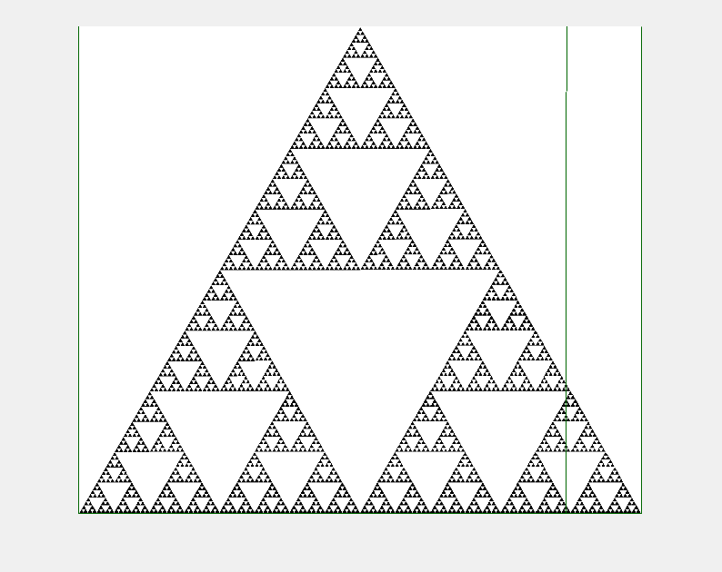
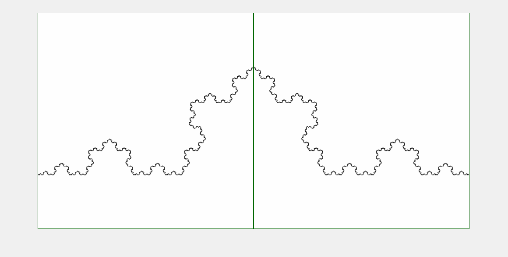
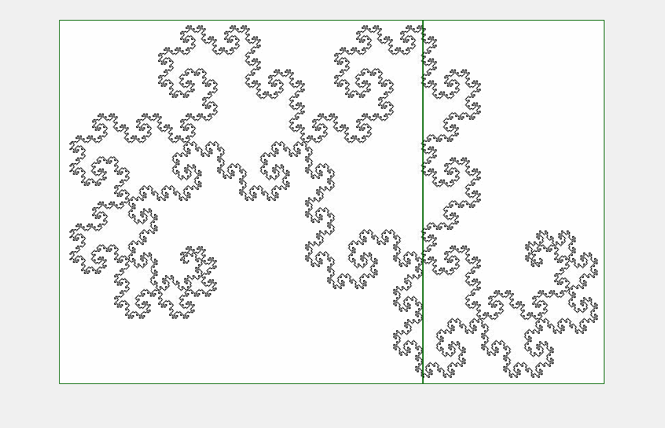

# Fractal Dimension Estimation using Box Counting Method

This repository contains MATLAB functions to estimate the fractal dimension, also known as *box counting dimension* or [*Minkowski dimension*](https://assets.cambridge.org/97811071/34119/excerpt/9781107134119_excerpt.pdf), od 2D dimensional images, using the box counting algorithm. The implementation allows visualization of the process and provides options to generate plots and GIFs.

## Features

- Computes the **Minkowski (fractal) dimension of a 2D images** of a 2D image.
- Allows visualization of the box counting process
- Support optional parameters for **plotting, saving results** and **Gif generation**

## Installation

Clone this repository using 

```bash
git clone https://github.com/RicardxJMG/box-counting-fractal-dimension
```

## Usage

Load the functions in MATLAB and call `minkowski_dimension` with an image input.

```matlab
image = imread('your_image.jpg')
divider_factor = 2;

% For estimate the fractal dimension
fd_estimation = minkowski_dimension(image, divider_factor)

% Estimate the fractal dimension and generates the log-log fit plot and save it with specific name 

fd_estimation = minkowski_dimension(image, divider_factor, 'plot_fit', 'save_plot', 'name_figure', 'your_figure_name')

% Create the box counting process in a GIF
minkowski_dimension(image, 'create_gif', 'gif_name', 'your_gif_name')
```

## Examples 

The following estimations was calculated using the `minkowski_dimension` function. The [Sierpiński triangle](https://en.wikipedia.org/wiki/Sierpi%C5%84ski_triangle) was generated by myself, while the [Koch Curve](https://en.wikipedia.org/wiki/Koch_snowflake) and the [dragon curve](https://en.wikipedia.org/wiki/Dragon_curve) were obtained from the [List of Fractals](https://en.wikipedia.org/wiki/List_of_fractals_by_Hausdorff_dimension) on Wikipedia. Unfortunately, the last two were transformed to JPG format which introduced some gray pixels and, therefore, noise.


|Name |Divider Factor|Real Fractal Dimension| Estimated | Gif |
|-----|-----|-----|-----|-----|
| Sierpinski | 2 | $\log_2 3$| 1.63 |  |
| Koch Curve | 1.25 | $\log_3 4$| 1.3 |  |
| Boundary of Dragon Curve | 2 | $\approx 1.5236$ |  1.83 ||

## Function

### 1. `minkowski_dimension`

**Inputs**

- `image_input` (3D matrix): RGB Image.
- `divider_factor` reduction factor for box size.
- **Optional Parameters:**
  - `'plot_fit'`: Generates log-log fit plot.
  - `'save_plot'`: Saves log-log plot in PNG and PDF.
  - `'name_figure'`: Custom name for saved plots.
  - `'create_gif'`: Generates a GIF of the box-counting process.
  - `'gif_name'`: Custom name for the GIF file.

**Outputs:**

- `fd`: Estimated fractal dimension.
- `box_data`: Iteration details (box count, sizes, images).

---

### 2. `box_counting`

**Description** Counts the number of boxes intersecting a non-white pixels in an image.
**Inputs:**

- `image` (3D matrix): RGB image.
- `box_length` (int): Box size.
- `previous_count` (binary matrix, optional): Prior count for optimization.

**Outputs:**

- `matrix_count`: Binary matrix indicating intersecting boxes.
- `total_boxes`: Total number of counted boxes.

---

### 3. `draw_boxes`

**Description:**
Overlays a grid on an image, drawing only the boxes that intersect non-white pixels.

**Inputs:**

- `image` (3D matrix): RGB image.
- `box_length` (int): Box size.

**Output:**

- `mesh`: Image with overlaid boxes.


---

## Issues

The following issues have been identified. These issues will fixed in future updates.

  - Currently, for better estimations of fractal dimension, the image dimensions be powers of 2.
  - The optimization of this code was specially developed for images with dimension that are powers of 2. I am still working in generalizing the algorithm. For now, that part of the code is commented out, but you can uncomment it if your image meets that condition. 
  - Occasionally , the generated gif does not correctly displays the box-counting process.

## License

This project is licensed under the MIT License.

## Author

- [Ricardo Martínez García](https://github.com/RicardxJMG)
